## 任务2设计文档

### Python(LogRecord)

Python `logging`模块通过`LogRecord`类的实例记录每条日志信息。输出日志时，`logRecord`实例的各个属性将通过对应`Handler`的`Formatter`进行格式化，成为一条日志字符串，被`Handler`输出到目标位置。

#### 属性说明

`LogRecord`的各个属性的说明如下：

| 属性名          | 格式字符串中的占位符  | 说明                                                         |
| :-------------- | :-------------------- | :----------------------------------------------------------- |
| asctime         | `%(asctime)s`         | 字符串。以可读字符串格式存储的，该`LogRecord`实例被创建的时间 格式可指定，默认格式如'‘2003-07-08 16:49:45,896’' |
| created         | `%(created)f`         | 浮点数。该`LogRecord`实例被创建的时间（格式同`time.time()`返回值） |
| filename        | `%(filename)s`        | 字符串。`pathname`的文件名部分                               |
| funcName        | `%(funcName)s`        | 字符串。该条日志产生的函数名                                 |
| levelname       | `%(levelname)s`       | 字符串。日志等级字符串  (`'DEBUG'`, `'INFO'`, `'WARNING'`, `'ERROR'`, `'CRITICAL'`) |
| levelno         | `%(levelno)s`         | 字符串。日志等级数字  (默认`DEBUG`=10, `INFO`=20, `WARNING`=30, `ERROR`=40, `CRITICAL`=50) |
| lineno          | `%(lineno)d`          | 整数。产生日志的函数调用所在行数                             |
| message         | `%(message)s`         | 字符串。为日志中的文本信息，且参数已经替换其中的占位符。     |
| module          | `%(module)s`          | 字符串。`filename`中的模块名部分。                           |
| msecs           | `%(msecs)d`           | 整数。该`LogRecord`实例被创建的时间的毫秒部分。              |
| name            | `%(name)s`            | 字符串。记录该条日志的`logger`名称。                         |
| pathname        | `%(pathname)s`        | 字符串。产生该条日志的文件所在路径。                         |
| process         | `%(process)d`         | 整数。进程ID。                                               |
| processName     | `%(processName)s`     | 字符串。进程名。                                             |
| relativeCreated | `%(relativeCreated)d` | 整数。`logger`创建后到日志生成的时间（毫秒）。               |
| thread          | `%(thread)d`          | 整数。线程ID。                                               |
| threadName      | `%(threadName)s`      | 字符串。线程名。                                             |

---

注：暂时仅考虑printf风格的格式字符串（即以'%'开头的占位符），且不考虑格式字符串长度指定等（如`%(asctime)20s`将输出的asctime字符串指定长度为20）

#### 属性字符串特性分析与匹配算法思路

分析上述属性，可以发现：

* `asctime`字串长度固定，格式已知
  * 对得到的日志字符串，可以直接进行字符串截取进行解析。效率应当快于普通的正则表达式匹配。

* `levelname`和`levelno`字串的取值集合确定（不考虑用户通过`logging`模块自定义的日志等级，该功能不常用）
  * `levelname`属性，可以通过只进行开头1个字符的匹配来解析日志等级为(`'DEBUG'`, `'INFO'`, `'WARNING'`, `'ERROR'`, `'CRITICAL'`)的其中之一，效率应当也快于普通的正则表达式匹配
  * `levelno`属性，同样可以通过只解析数字字符串的第一个字符（即十位数）来解析日志等级

对于其余属性，将各个属性表示为正则语法如下：

| 属性名          | 对应的正则语法                                        | 说明                                                         |
| :-------------- | :---------------------------------------------------- | ------------------------------------------------------------ |
| created         | \\d+(.\\d+)?                                          | 可能没有小数部分                                             |
| filename        | \[\^\\*\\?\\"\\<\\>\\\|\\\\:/\]                       | 此为Windows要求的文件名格式 不能包含特殊字符`/`,`\`, `*`, `?`, `"`, `<`, `>`, `|`, `:`。可以有**空格** |
| funcName        | [a-zA-Z\_][\\w_\]*                                    | Python2对函数名的要求 （Python3则还需支持utf-8中的其它字母） |
| lineno          | \d+                                                   | 不定长整数                                                   |
| message         | .*                                                    | 可能出现所有可见字符、空格、制表符等等                       |
| module          | \[^<>/\\?\|:*"\]+                                     | 即为filename除“.py”的部分                                    |
| msecs           | \d{1,3}                                               | 毫秒数，0~999的某值                                          |
| name            | .*                                                    | 可能出现所有可见字符、空格 logger名称可存在制表符、换行符等，但输出日志似乎会忽略之 |
| pathname        | \^\[a-zA-Z\]:\(\/\[\^\\*\\?\\"\\<\\>\\\|\\\\:/\]+\)+$ | 是为Windows要求的路径格式 可能存在**空格**              |
| process         | \\d+                                                  | 不定长整数                                                   |
| processName     | \w+                                                   | 不确定是否存在空格等                                         |
| relativeCreated | \d+                                                   | 不定长整数                                                   |
| thread          | \d+                                                   | 不定长整数                                                   |
| threadName      | \w+                                                   | 不确定是否存在空格等                                         |

可知，以上属性的字符串长度均不固定，且包含的字符集非常大。若不考虑聚类分析等启发式算法，则只能采用较为通用的`DFA`，即有限状态机算法进行匹配。

#### 解析算法设计

整体来说，解析算法分两步，首先进行格式字符串的预处理，之后进行日志字符串的匹配与解析。

##### 格式字符串预处理

将格式字符串中的各个字符分为两类，一类组成了`LogRecord`的占位符；另一类则是字面常量。

进一步地，将格式字符串划分为多个片段，这些片段分为两类且交替在格式字符串中出现，对应字符两种类型，一类为**占位符串**，另一类为**分割串**

如，对于格式字符串`'Asctime: %(asctime)s# Created: %(created)f # Filename: %(filename)s'`，将被划分为7个片段：

* 分割串`'Asctime:' `
* 占位符串`'%(asctime)s'`
* 分割串`'# Created: '`
* 占位符串`'%(created)f'`
* 分割串`' # Filename: '`
* 占位符串`'%(filename)s'`
* 分割串`'\0'`（结束符）

##### 日志字符串的匹配与解析

对每条日志，采用**双指针法**同时进行格式字符串和日志字符串的遍历与解析。此处只需对格式字符串指针所指的字符所在片段进行分类讨论即可。

* 若当前格式字符串指针指向分割串中的某个字符，则直接进行字符的匹配
* 若当前格式字符串指针指向占位符串，则
  * 判断该占位符是否为`asctime`或`levelname`以及`levelno`三种属性，若是，则直接进行字符串截取或是首字符进行判断并解析
  * 否则，进行基于DFA的匹配操作
    * 即格式字符串指针保持不动，日志字符串指针一直前进，直至遇到下一个分割串的起始字符。将该过程中日志字符串指针所遍历的子串截取出来，作为当前属性的解析结果串。
    * 格式字符串指针向后移动至下一个分割串位置，继续后续的匹配过程

重复执行上述过程直至当前日志字符串与格式字符串遍历结束。

##### 回溯

上述算法在对不定长格式字符串的匹配时，可能会存在需要回溯来解决的失配情况：

如日志字符串为`'This is a msg. foo'`，匹配的格式字符串`'%(message)s %(funcName)s'`

按照上述流程，`This`将被解析为`message`，`is`将被解析为`funcName`，这导致后续的` 'a msg. foo'`失配。实际上我们需要将`'This is a msg.'`解析为`message`，而`foo`解析为`funcName`。

>  问题的根源在于`This is`中间的**空格**被解析为了`'%(message)s %(funcName)s'`中间的空格，即分割串。但实际上该空格应被解析为`message`的一部分。
>
>  换言之，这里存在一种**移进-规约冲突**，对于该空格，两种操作均符合文法:
>
> * 被**移进**并规约作为格式串的分割串
> * 被**规约**到格式串的`message`的一部分

为了解决这一问题，在上述算法的基础上，引入栈与回溯操作。每当遇到这种**移进-规约冲突**时，用栈来记录当前指针位置。由于上述算法实际上默认进行了**移进**操作。因此每当该算法遇到失配问题后，回溯到栈顶位置，将此时日志字符串指针所指位置**规约**为**占位符串**的一部分，并从该位置重新进行匹配后续字符串，直至不存在失配为止。

#### 算法流程图

综上，得到算法流程图：

